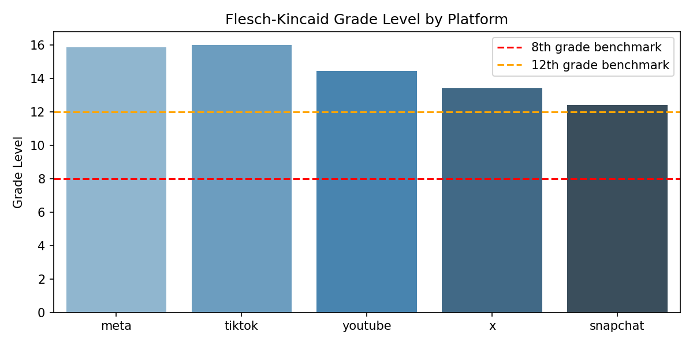
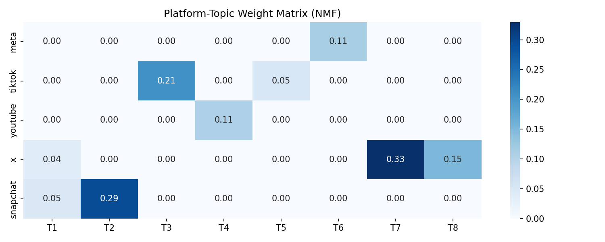
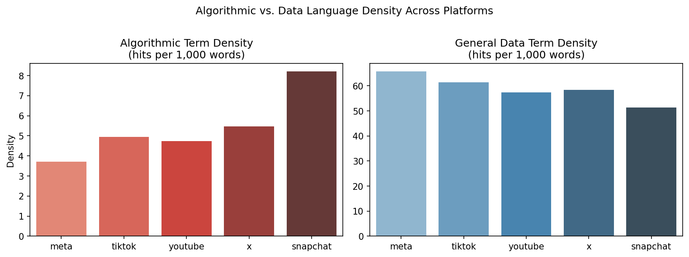
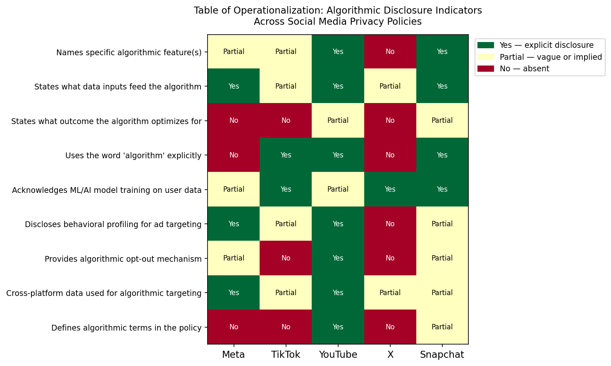

```{r}
#| include: false
# Load outputs for inline figures
```

## Introduction

Every day, billions of people click "I agree" on social media platforms without reading a word of what they are agreeing to. The outcome is predictable, and the system was designed to produce it. Every scroll, pause, like, skip, and search a user makes gets logged, processed, and fed into algorithmic systems built to predict what keeps that user engaged long enough to serve another advertisement. The content users post is incidental to this. The behavioral data they generate is the product. The privacy policy is the legal instrument that makes this extraction legitimate. It is, in theory, the mechanism of informed consent. In practice, it functions closer to a liability shield written in a language most users cannot read, about practices most users do not know are occurring.

This paper examines how five major social media platforms -- Meta (Facebook/Instagram), TikTok, YouTube (Google), X (formerly Twitter), and Snapchat -- use their privacy policies to technically disclose data practices while systematically obscuring the algorithmic systems at the core of their business models. Using a four-phase computational analysis combining readability scoring, topic modeling, and keyword density measurement, this paper argues that the consent these policies produce is a legal fiction, one manufactured through deliberate opacity rather than genuine disclosure. The consent framework arrived at this state through a series of deliberate choices, and walking it back will require intervention at the same level of deliberateness.

The analysis pursues four research questions. First, at what reading level are these policies written and what does that imply for the possibility of meaningful consent? Second, what topics dominate the policy corpus and what is conspicuously absent? Third, how does the density of algorithmic disclosure language compare to general data collection language across all five policies? Fourth, what regulatory mechanism would remedy this deficit and what existing precedent supports it?

The findings are consistent across all four analytical lenses. Every policy is written at college level or above, far beyond the reading level of the average American adult. Topic modeling reveals a corpus organized around data collection logistics, legal compliance, and platform branding, with no meaningful topic mass devoted to algorithmic recommendation or behavioral profiling. Keyword analysis finds that general data language outnumbers algorithmic language by ratios ranging from 6:1 to 18:1 across platforms. And a manual operationalization of nine disclosure indicators finds that not one of the five platforms fully discloses what its algorithm optimizes for. The data goes further than establishing that these policies are hard to read and shows that policies are silent, in ways that hold across every platform and every analytical method applied here, on the practices users most need to understand before agreeing to anything.

## Literature Review

Every time a user opens TikTok, scrolls through Instagram, or sits through one more YouTube recommendation, they are doing two things simultaneously. They are using a service and generating data about how they use it. The first part is obvious but the second is the part that built an industry. Shoshana Zuboff calls the excess data "behavioral surplus" which is the information platforms collect beyond what delivering the service actually requires. Her argument is that this surplus is not a byproduct of the business model. It is the business model in itself [@zuboff2019]. Every pause, every scroll, every moment of hesitation gets harvested, refined into predictions about future behavior, and sold. The user is the source material and the advertiser is the customer.

Understanding that reframes what a privacy policy actually is. In theory, it is the document that tells users what is being done with their data and asks for their agreement. In practice, it functions more like what economists call an incomplete contract, an agreement that leaves deliberate gaps because one party benefits from the ambiguity. @grossman1986 demonstrated that contracts are written this way on purpose, because vagueness preserves flexibility for the party with more power to exploit it. Platform privacy policies are a textbook case. Language like "we may use your information to improve your experience" and "we share data with trusted partners" sounds like disclosure. It authorizes almost anything while committing to almost nothing. The platform retains the flexibility it needs while the user signs off on terms they cannot meaningfully evaluate.

If that ambiguity were shrinking over time, it might be possible to argue that transparency is improving and that patience is the appropriate response. @belcheva2023 looked at exactly this question and found the opposite. Their longitudinal analysis of privacy policy language shows that obfuscatory phrasing -- the kind that is vague, passive, and non-committal -- has grown more common even as public awareness of data privacy has increased and regulatory pressure has mounted. Platforms have gotten better at sounding transparent without becoming more transparent. The gap this paper measures in algorithmically specific language has been growing, not shrinking, which points toward something more intentional than an industry still catching up to its own complexity.

There is also a harder problem underneath the readability one, which is that even clearly written privacy policies would face serious limitations as consent mechanisms. @acquisti2015 documented through behavioral economics research that people systematically underweight future privacy harms relative to immediate platform utility, read data sharing as benign when it is embedded in familiar interfaces, and generally lack the contextual knowledge to evaluate what specific data practices actually mean for their lives. A user who could read and fully understand a privacy policy would still face significant obstacles to making a genuinely informed decision about what they were agreeing to. The unreadability this paper documents makes an already compromised process worse, compounding a structural problem rather than being the whole of it.

Regulators have recognized pieces of this problem and moved to address them, though not always at the right level. The GDPR requires plain-language disclosure of data processing purposes, but it was designed before algorithmic personalization became the central mechanism of platform business models, and it imposes no specific obligation to disclose how recommender systems work. The EU Digital Services Act is more precisely targeted, with Article 27 requiring large platforms to disclose the main parameters of their recommender systems in plain and intelligible language, along with the options users have to modify or opt out of those systems [@dsa2022]. That requirement is the closest existing regulatory analog to what this paper argues is missing from American policy. In the United States, the Kids Online Safety Act passed the Senate 91-3 before stalling in the House, a signal that appetite for algorithmic accountability legislation exists even where the legislative process has not yet delivered it [@kosa2024]. The FTC's 2024 report on social media data practices documents, at the federal level, exactly the gap this analysis measures, finding extensive disclosure about data collection alongside minimal disclosure about what that collected data is actually used to power [@ftc2024].

## Data and Methods

The five platforms selected for this analysis represent both the scale and the diversity necessary to make a structural argument. Meta, TikTok, YouTube, X, and Snapchat are consistently among the most widely used social media services in the United States [@pew2024], but they do not operate the same way. Meta's system centers on cross-platform behavioral advertising. TikTok's is built around an interest-graph recommendation engine whose outputs have become the platform's defining feature. YouTube optimizes for watch time. X curates timelines around engagement signals. Snapchat combines a social graph with public content discovery. If the same transparency deficit appears across that range of architectures and business models, it is more convincingly a feature of the industry than a choice made by any individual company.

Policy texts were collected in May 2026 using a Python script to extract visible HTML text from each platform's published privacy policy URL. Meta's policy required a different approach. Its page renders a substantial portion of its content through JavaScript accordion sections that a static scrape cannot reach, which means a straightforward collection attempt returns only a fraction of the actual document. Obtaining the full text required using Meta's own printable policy version, which renders all sections continuously, and extracting it from a PDF using pdfplumber. The difference between the two methods produced 6,513 words from the static scrape and 22,206 from the printable version. The other four platforms were collected via static scrape without issue, and all five texts were saved as plain-text files for analysis.

The analysis proceeded in four phases. The first scored each policy on five standard readability metrics using the Python `textstat` library: Flesch Reading Ease, Flesch-Kincaid Grade Level, Gunning Fog Index, SMOG Index, and Dale-Chall Readability Score, interpreting results against established benchmarks for public-facing consent documents. The second applied Non-negative Matrix Factorization to the five-document corpus using TF-IDF vectorization, extracting eight topics to examine what the policies foreground and what they omit. Five documents cannot produce the generalizability a larger dataset would allow, which is why the stronger finding from this phase concerns what none of the topics contain rather than what any individual topic does. The third phase constructed two keyword lexicons, an algorithmic disclosure lexicon of 22 terms developed iteratively through close reading of extracted sentences, and a general data collection lexicon of 10 terms, normalizing both per 1,000 words to allow comparison across policies of different lengths. The fourth manually coded nine binary disclosure indicators across all five platforms based on close reading of algorithmically relevant sentences, translating the broader claim about algorithmic silence into concrete, verifiable measurements.

## Results

The readability results land in a consistent place regardless of which metric you use. Flesch-Kincaid Grade Level scores range from 12.4 for Snapchat to 16.0 for TikTok. Snapchat is the most readable policy in this corpus and is still written at the level of a high school senior. TikTok is the hardest to read despite being the shortest, at 4,246 words, which suggests density of language rather than length is driving the complexity. The Gunning Fog Index, which estimates the years of formal education required to understand a text on first reading, ranges from 15.1 to 19.0 across the five platforms. Dale-Chall scores exceed 10.0 for every platform in the corpus as a score above 9.0 is classified as comprehensible only by college graduates. Every platform fails every benchmark by a significant margin, and the average American adult reads at approximately an 8th-grade level. Clicking "I agree" on any of these policies does not constitute informed consent in any meaningful sense. It constitutes legal cover for data practices described in a language built for lawyers, not users.

| Platform | FK Grade | Flesch Ease | Gunning Fog | SMOG | Dale-Chall |
|----------|----------|-------------|-------------|------|------------|
| Meta | 15.9 | 30.8 | 17.7 | 15.6 | 11.8 |
| TikTok | 16.0 | 26.8 | 19.0 | 16.9 | 11.7 |
| YouTube | 14.4 | 37.3 | 17.6 | 15.7 | 11.6 |
| X | 13.4 | 39.5 | 16.3 | 15.0 | 10.8 |
| Snapchat | 12.4 | 45.9 | 15.1 | 14.0 | 10.3 |
| **Benchmark** | **≤ 8** | **≥ 60** | **≤ 12** | **≤ 8** | **< 7.0** |

: Readability scores by platform. Higher Flesch Ease = more readable; all other metrics indicate grade or education level required. {#tbl-readability}

{#fig-readability fig-alt="Bar chart showing FK grade level for all five platforms, all well above the 8th grade benchmark line."}

The topic modeling results make visible something the readability scores can only imply. The eight topics extracted from the corpus organize around platform branding and features, general user experience language, EU data transfer compliance, and, in one case, PDF extraction artifacts from the Meta printable version that carry no analytical weight. What they do not organize around is more significant than what they do. Across eight topics representing the full semantic space of the corpus, none is meaningfully structured around algorithmic recommendation, content ranking, behavioral profiling, or the logic by which user behavior gets converted into engagement optimization. The word "algorithm" does not appear in any topic's top terms. Neither does "recommendation." The closest the model comes is "personalize" in Topic 1, sitting alongside generic service language in a cluster that could describe any software product. The topic structure of these policies, read as a whole, is a map of deliberate omission.

| Topic | Top Terms | Interpretation |
|-------|-----------|----------------|
| T1 | experience, profile, website, usage, integrations, personalize | General service / user experience |
| T2 | snapchat, snap, friends, spotlight, map, memories | Snapchat social features |
| T3 | tiktok, network, sellers, marketing, usds, joint | TikTok U.S. operations / business |
| T4 | google, search, youtube, signed, collects, manage | Google / YouTube account management |
| T5 | tiktok, https, ad, accounts, audio, metadata | TikTok ad / metadata practices |
| T6 | meta, facebook, printable, mbasic, collects | Meta PDF artifacts (no analytical weight) |
| T7 | ad, dpf, affiliates, eu, switzerland, disclose | Cross-border data transfer / legal |
| T8 | dpf, eu, countries, job, deactivated | EU / international compliance |

: NMF topics — top 12 terms per topic. {#tbl-topics}

{#fig-heatmap fig-alt="Heatmap showing how strongly each of the 8 NMF topics loads onto each of the 5 platforms."}

The keyword density analysis puts precise numbers to that omission. General data collection language outnumbers algorithmic disclosure language by ratios ranging from 6.3:1 for Snapchat to 17.7:1 for Meta, with a corpus average of approximately 12:1. Meta's ratio deserves particular attention. The company operates one of the most sophisticated behavioral advertising and algorithmic content-ranking systems ever built, processing data from billions of users across Facebook, Instagram, WhatsApp, and Messenger. Its privacy policy returns 83 algorithmic term hits across 22,206 words. TikTok, whose For You Page algorithm drove its explosive growth and has been examined in multiple Congressional hearings, mentions algorithmic terms 21 times across its entire policy.

| Platform | Algo Hits | Algo Density | Data Hits | Data Density | Ratio |
|----------|-----------|-------------|-----------|-------------|-------|
| Meta | 83 | 3.71 | 1,469 | 65.70 | 17.7:1 |
| TikTok | 21 | 4.95 | 261 | 61.47 | 12.4:1 |
| YouTube | 49 | 4.74 | 594 | 57.40 | 12.1:1 |
| X | 30 | 5.46 | 321 | 58.47 | 10.7:1 |
| Snapchat | 45 | 8.20 | 282 | 51.40 | 6.3:1 |

: Algorithmic vs. general data term density (hits per 1,000 words). {#tbl-keywords}

{#fig-density fig-alt="Side-by-side bar charts comparing algorithmic and data term density across platforms."}

Reading the sentences that do contain algorithmic language reveals the qualitative dimension of what the numbers describe. Where algorithmic language appears, it tends to be passive, abstract, and constructed to acknowledge a practice without actually explaining it. Meta writes that "our systems automatically process information we've collected and stored associated with you and others to assess and understand your interests and your preferences." The sentence confirms that automated processing happens. It says nothing about what the system optimizes for, what behavioral signals it weights, or what the assessments it produces are used to do. TikTok states that it personalizes "certain features and content, such as providing your 'For You' feed," which names the product while explaining none of its logic. YouTube goes slightly further, stating "we also use algorithms to recognize patterns in data," and is the only platform in this corpus to define "algorithm" in a glossary, as "a process or set of rules followed by a computer in performing problem-solving operations." That definition is technically accurate and tells a user nothing about what YouTube's recommendation system actually does.

Snapchat offers the one genuinely informative sentence in the entire corpus: "if you watch a lot of sports content, but skip content with hair and makeup tips, our recommendation algorithms will prioritize sports, but not those makeup tips." This is the only moment across all five policies where a platform explains, in terms a user could actually act on, how a specific algorithmic behavior works. It is one sentence, in one policy, and it still does not disclose what the algorithm is ultimately trying to produce.

The operationalization table confirms the pattern across nine specific indicators. No platform fully discloses what its algorithm optimizes for. YouTube comes closest, describing recommendations as aimed at producing "more relevant results," but relevance is defined by the platform and the policy does not disclose that it is operationalized through watch time, engagement rate, and re-engagement metrics. Snapchat lists "personalization, advertising, safety and security, fairness and inclusivity" as algorithmic purposes, a formulation broad enough to describe almost any system behavior. X is the least transparent platform by nearly every measure, never using the word "algorithm," naming no specific algorithmic features, disclosing no profiling practices, and offering no opt-out mechanism, while simultaneously acknowledging that it trains machine learning models on user data. It discloses the infrastructure and omits the purpose entirely.

| Indicator | Meta | TikTok | YouTube | X | Snapchat |
|-----------|------|--------|---------|---|----------|
| Names specific algorithmic feature(s) | Partial | Partial | Yes | No | Yes |
| States what data inputs feed the algorithm | Yes | Partial | Yes | Partial | Yes |
| States what outcome the algorithm optimizes for | No | No | Partial | No | Partial |
| Uses the word "algorithm" explicitly | No | Yes | Yes | No | Yes |
| Acknowledges ML/AI model training on user data | Partial | Yes | Partial | Yes | Yes |
| Discloses behavioral profiling for ad targeting | Yes | Partial | Yes | No | Partial |
| Provides algorithmic opt-out mechanism | Partial | No | Yes | No | Partial |
| Cross-platform data used for algorithmic targeting | Yes | Partial | Yes | Partial | Partial |
| Defines algorithmic terms in the policy | No | No | Yes | No | Partial |

: Operationalization of algorithmic disclosure indicators. Yes = explicit disclosure; Partial = vague or implied; No = absent. {#tbl-operationalization}

{#fig-operationalization fig-alt="Color-coded heatmap showing Yes/Partial/No for nine disclosure indicators across five platforms."}

## Normative Analysis

What the data describe is a system that functions as designed. The platforms examined here are not failing at transparency in the way that a company might fail at customer service, through inattention or resource constraints or poor execution. The findings point toward something more deliberate, a consent framework structured so that the practices most central to the platform's commercial operation are the ones least visible in the documents users sign to authorize them. Zuboff's framework is worth applying precisely because it describes the incentive structure rather than just the outcome [-@zuboff2019]. If behavioral surplus is the product, and the privacy policy is what makes its extraction legitimate, then the policy has every reason to describe data collection in detail and every reason to say as little as possible about what that data does.

Kant's second formulation of the categorical imperative holds that persons must be treated as ends in themselves and never merely as means. A platform that converts user behavior into prediction products sold to advertisers, without providing the information that would allow users to understand and evaluate that conversion, is using those users instrumentally. The privacy policy is supposed to be the document that closes that gap. A policy written at the 16th-grade reading level, systematically absent of any account of what the algorithm optimizes for, does not close it, but instead formalizes it. The form of consent does exist. However, the substance does not, and a consent framework whose legitimacy depends on most users not reading or understanding it cannot survive the universalizability test Kant's ethics requires. Genuine transparency about algorithmic practices would threaten the business model and opacity holds this arrangement together.

The consequentialist case follows from the harms that arrangement enables. Algorithmic amplification of emotionally engaging content has been linked to political polarization, health misinformation, and documented damage to adolescent mental health. These are documented harms that have drawn regulatory attention across multiple jurisdictions, including examination at the federal level by the FTC [@ftc2024]. The systems producing these outcomes have structural incentives to surface content that provokes outrage and social comparison because those affective states extend session length and increase ad exposure, regardless of what they do to the people experiencing them. Users have consented, on paper, to systems they cannot read about, governing practices those documents never actually describe. When platforms face scrutiny for algorithmic harm, they invoke that consent as a defense. That defense only holds if the consent underlying it was real, and four analytical phases of this paper have been building the case that it was not.

## Policy Recommendation

The findings presented here describe a measurable failure in how Americans consent to the data practices that govern the most commercially consequential dimension of their digital lives. As a data scientist, I am not in a position to tell policymakers what values to hold. I am in a position to tell them what the data show, and what those findings imply for anyone who believes that informed consent should mean something.

The data show the privacy policies of the five most widely used social media platforms in the United States are written at college level, largely silent on how behavioral data is used algorithmically, and structured in ways that guarantee most users will not read or understand them. The consent those policies nominally produce is a legal formality that platforms use to authorize data practices they are simultaneously designed to obscure. Two reforms would address this directly: one achievable now, the other the right long-run goal.

### Mandatory Algorithmic Impact Disclosures

Congress should require that any platform collecting behavioral data from US users disclose, in plain English, four things within its privacy policy. First, what algorithmic systems the platform uses to determine what content a user sees. Second, what categories of data those systems use as inputs. Third, what outcome the algorithm is designed to optimize. Fourth, what options the user has to modify or opt out of algorithmic curation entirely.

This requirement already exists elsewhere. The EU Digital Services Act mandates exactly this for large platforms under Article 27, requiring disclosure of "the main parameters used in recommender systems" in "plain and intelligible language" [@dsa2022]. Meta, TikTok, YouTube, and Snapchat have all produced these disclosures for their European users. The compliance infrastructure exists and extending equivalent protections to American users requires a regulatory decision, not a technical one.

Any such requirement must include a readability standard. A disclosure written at college level offers nothing to a population that reads at the 8th grade. The FTC has authority under Section 5 of the FTC Act to police deceptive practices and has used that authority to mandate plain-language disclosures in financial services and healthcare contexts. Applying the same standard to algorithmic impact disclosures, with a ceiling of no higher than 8th-grade reading level for core disclosures, is a proportionate extension of existing enforcement authority. Platforms would remain free to publish detailed technical documentation alongside those disclosures. The plain-language summary is the floor.

The political conditions for this reform are present. KOSA cleared the Senate 91-3, demonstrating that bipartisan support for algorithmic accountability legislation exists [@kosa2024]. The FTC's 2024 report documented the problem at the federal level [@ftc2024]. Algorithmic impact disclosure requirements are the logical next step.

### Data Minimization for Behavioral Surplus

The disclosure requirement addresses what users are told. The deeper problem is what platforms are permitted to do regardless of what they disclose. Platforms currently collect behavioral data to deliver a service and repurpose it, without real restriction, to build predictive profiles of user psychology sold to advertisers. The appropriate long-run standard is data minimization, meaning platforms should be prohibited from using behavioral surplus for algorithmic profit optimization without explicit opt-in consent obtained separately from the general terms of service agreement. A user who wants a personalized feed should be able to choose one. A user who does not should receive a service that does not profile their behavior for commercial gain. The GDPR establishes this framework in Europe and there is no technical reason it cannot apply in the United States.

This reform faces a harder political path. Federal data minimization legislation has not advanced in the current Congress, and industry opposition would be significant. That political reality does not change what the findings demand. Disclosure requirements, however well designed, do not fix a business model that depends on users not fully understanding what they have authorized. Telling users more about how the system works is a more meaningful improvement and limiting what the system is permitted to do with their data is the structural one.

### What Policymakers Should Take from This Report

Three things are worth taking from this report. First, the consent problem is measurable and documented. Every major social media platform in the United States is producing consent documents that the population they govern cannot read, describing practices those documents systematically fail to disclose, and the data supporting that finding are in this report. Second, a ready model for reform already exists. The EU has already required the disclosures that US platforms are withholding from American users, and that gap is a policy choice that can be reversed. Third, disclosure is the floor rather than the ceiling. A regulatory environment in which platforms are required to describe what their algorithms do, while remaining free to do it, still leaves the structural incentives that produce algorithmic harm fully intact. Policymakers who want to address the problem at its source will need to go further than disclosure alone.

## Conclusion

Four analytical methods, all pointing in the same direction, produce a finding that is difficult to attribute to coincidence. The privacy policies of the five most widely used social media platforms in the United States are written at a level most Americans cannot read, organized around data collection logistics and legal compliance rather than the algorithmic systems that define these platforms' commercial value, and silent, in ways that appear deliberate, on the question users most need answered before agreeing to anything.

The silence makes sense when you understand the incentive structure. Algorithmic recommendation engines, engagement optimizers, and behavioral profiling systems are not peripheral features of these platforms. They are the mechanism by which behavioral surplus becomes advertiser revenue. A privacy policy that described, in plain terms, that a platform is optimizing content delivery to maximize the time users spend in states of emotional arousal in order to maximize ad exposure would be a policy that made the consent transaction significantly harder to complete. The deliberate vagueness documented in this whitepaper is the mechanism by which that difficulty is avoided.

Better design and shorter documents will not fix this. A consent framework built around deliberate non-disclosure of its most consequential practices is not functioning as a consent framework at all, regardless of how it is presented. Mandatory algorithmic impact disclosures, modeled on the DSA's Article 27 and enforced with a plain-language readability standard, represent the minimum intervention necessary to make consent mean something again. The data have made the case but now it is a policy decision.

## References {.unnumbered}

::: {#refs}
:::
